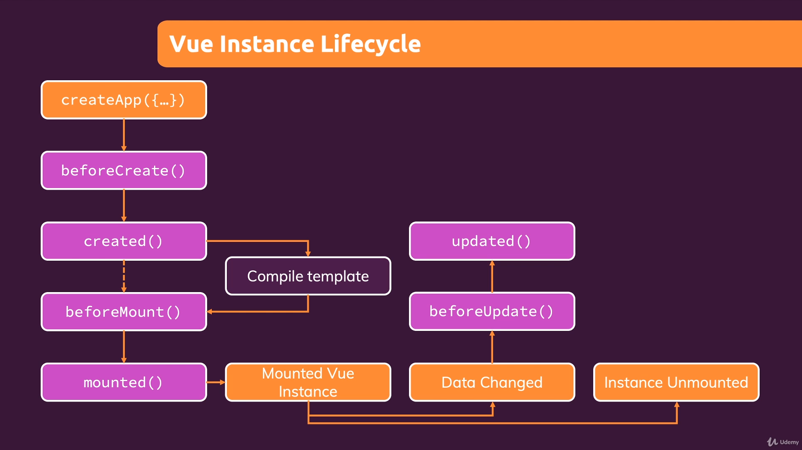

# Vue - The Complete Guide

## Supported prop values 

In general, you can learn all about prop validation in the official 
docs: https://v3.vuejs.org/guide/component-props.html

Specifically, the following value types (type property) are supported:

- String
- Number
- Boolean
- Array
- Object
- Date
- Function
- Symbol

But type can also be any constructor function (built-in ones like Date or custm ones).

## Vue Instance Lifecycle

    
